# Term 2 Rails Project
## BookShop


Heroku: https://bookshop-ca.herokuapp.com

GitHub repository: https://github.com/xrozzi/book-shop


BookShop is a two sided marketplace for people to buy new and second hand books.

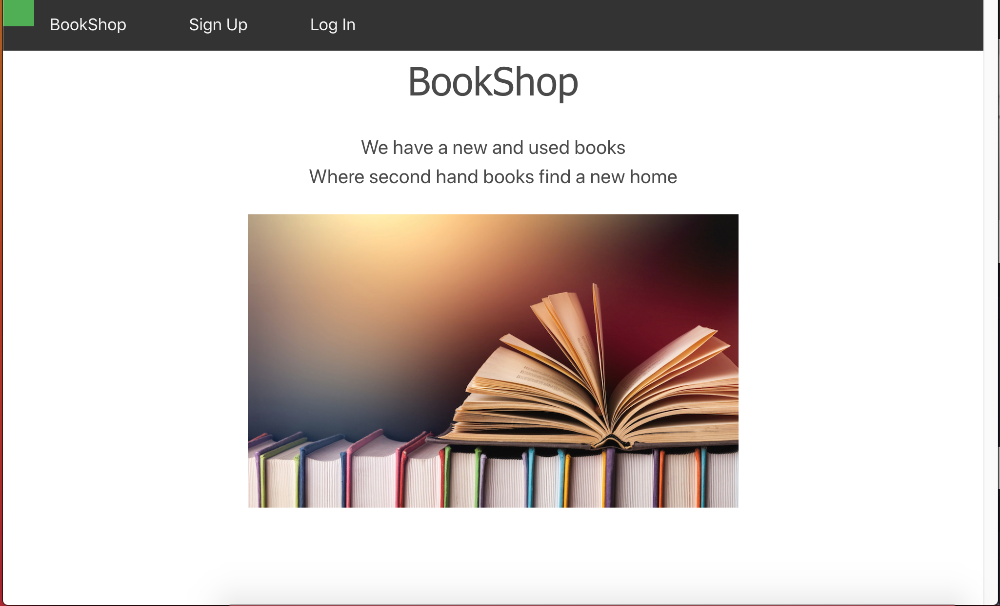

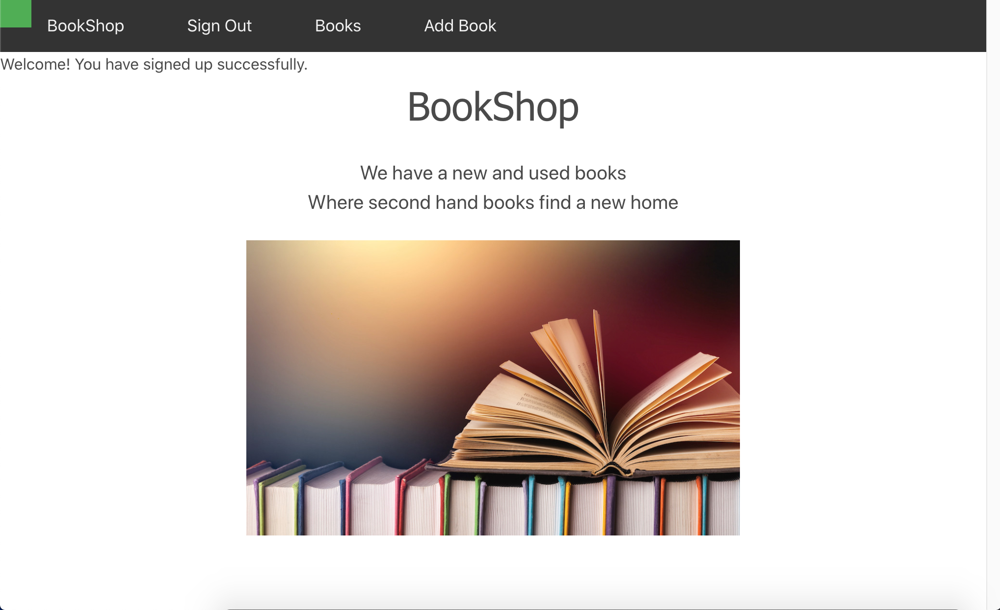

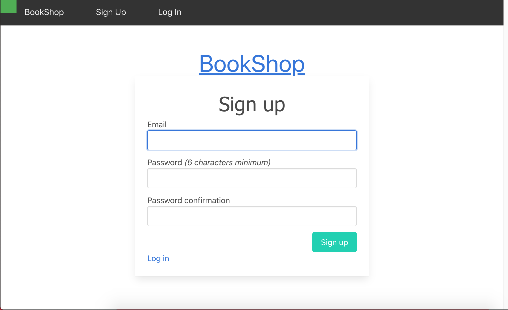

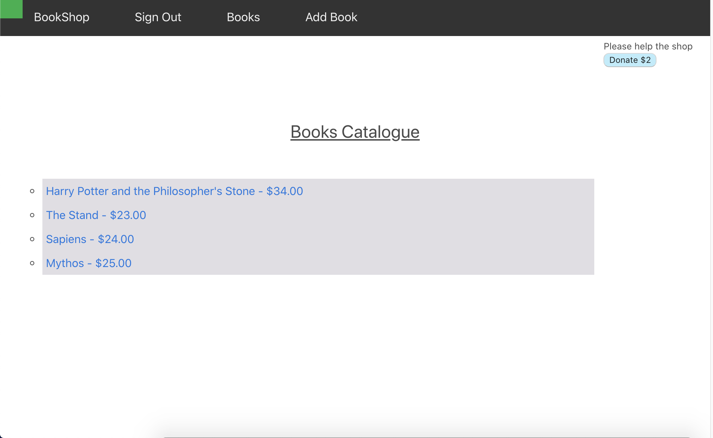

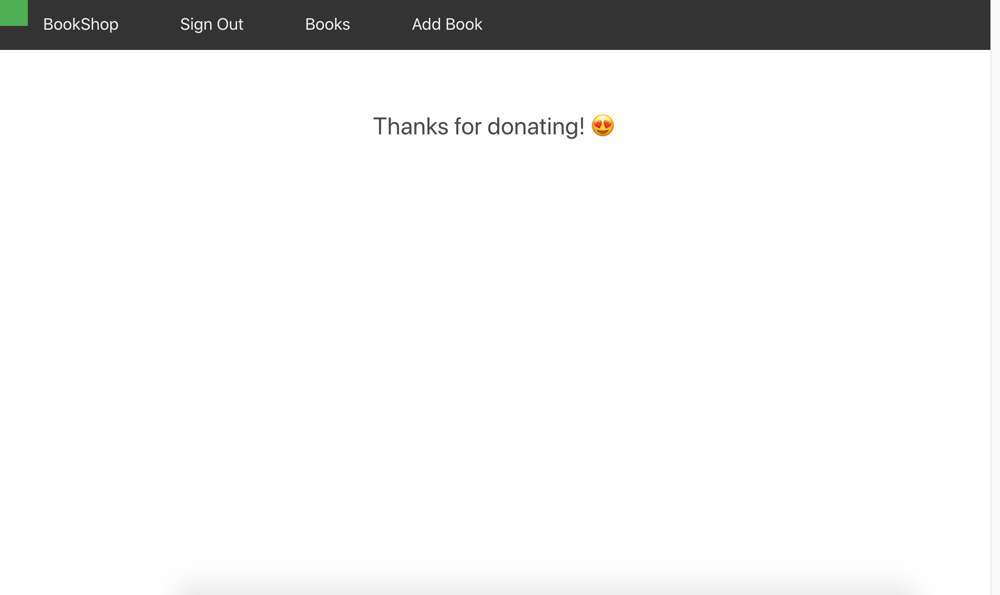


##### Target Audience

BookShop is targeted at people that enjoys reading, and would like to save trees while saving some money.


##### Tech Used

Front-end: HTML5, CSS3, SCSS, Embedded Ruby, Bootstrap.

Back-end: Ruby 2.7.1, Ruby on Rails 5.2.4.

Database: Postgresql, D-Beaver.

Utilities: Stripe, Devise, Ultrahook, AWS S3.

Deployment: Heroku.

##### 1. Explain the different high-level components (abstractions) in your App.

BookShop is a two way marketplace application that has been created by using Ruby on Rails framework. Ruby on Rails follows the  MVC framework. The Model defines the facilitates the storage and retrieval data. The View renders he user interface, contains minimal acceptable logic. The Controller glues everything together, it's the logic that interacts with the Model and the View.

BookShop was created using PostgreSQL database system. PostgresQL is a powerful, open source object-relational database system that combines and extends the SQL language with numerous features that safely store and scale the most complicated data workloads.


##### 2. List and describe any 3rd party services.

##### Devise
Devise is a Ruby gem that allows flexible authentication solution for Rails. Devise was used to authenticate the user with an email and a password with the generated Devise forms. To allow the user access to Book listings we used a the Devise function current_user.

```ruby
gem 'devise'
```

##### Stripe
Stripe is a technology company that builds economic infrastructure for the internet. Stripe was used to accept donations in the marketplace.

```ruby
gem 'stripe'
```
##### Amazon S3
Amazon S3 is a simple cloud services interface that can be used to store and retrieve any amount of data from anywhere on the internet, at any time. Amazon S3 was used to upload Book's images.

```ruby
gem 'aws-sdk-s3'
```
##### Bulma
Bulma is a modern CSS framework based on Flexbox. Bulma was used to format Devise forms.

```ruby
gem 'bulma-rails'
```

##### Heroku
Heroku is a cloud platform as a service (PaaS) that lets companies build, deliver, monitor, and scale apps. Heroku was used to deploy the marketplace to the web.


##### 3.1. Identify the problem you’re trying to solve by building this particular marketplace App?
Everyone at home has a book that has read and is lying around. The aim of BookShop is to give secondhand books a new home. In BookShop registered users can sell books, new or used books, without any fees. In this way, users can get a fair price for their books. Other websites charge a fee, or if you sell the books directly to them, they don't give you a fair price. BookShop future projects are to create a community where users can create posts about their favourite books and give ratings. BookShop would like to help the enviroment and create a lovely comunity of book lovers!


##### 3.2 Why is the problem identified a problem that needs solving?
Most websites only accept directly sell to them so that they can resell them for a higher price. This can be discouraging for some people and decide to keep books that they use somewhere at home. With BookShop you decide the price you think you books are worth.

##### 4. Describe your project’s models in terms of the relationships (active record associations) they have with each other.

##### User
- A user <u>has_many</u> listings.
- If user is removed, the user's listings will be destroyed

```ruby
class User < ApplicationRecord
  
  devise :database_authenticatable, :registerable,
         :recoverable, :rememberable, :validatable

has_many :listings, dependent: :destroy

end
```

##### Listing
- A listing <u>belongs_to</u> a user.

```ruby
class Listing < ApplicationRecord
  belongs_to :user
  #the listing NEEDS to have those 3 params
  validates :title, :description, :price, presence:true
  has_one_attached :picture
end
```
##### Active Storage

- A listing <u>has_one_attached</u> picture, a picture <u>belongs_to</u> a listing.

##### 5. Discuss the database relations to be implemented.

To explain better BookShop I will use Book instead of Listing

The User model has user_id and an email as atrributes. The user_id is needed to create a book listing. A User has_many Books

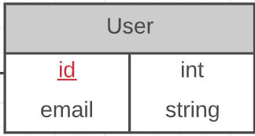

The Book model has title, price, description, picture and foreign key(user_id. The foreign key let us know which user created the book listing.
A Book belongs_to to a User

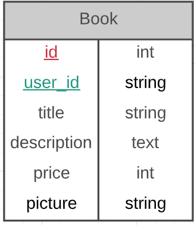

##### 6. Provide your database schema design.

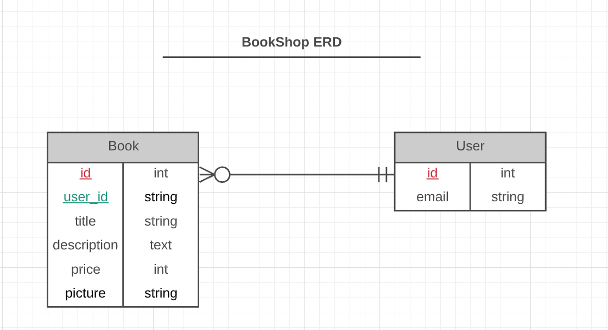

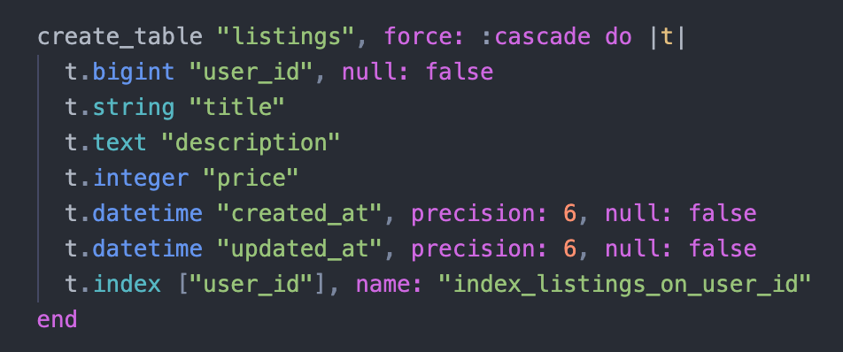

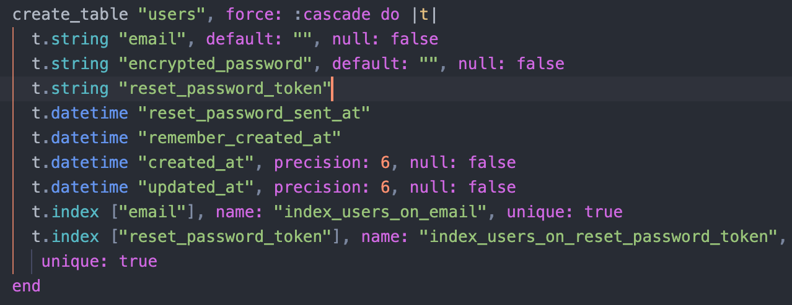

##### 7. Provide User stories for your App.

* As a register user, I want to be able to see all book listings, so that I can see
    what's on the market

* As a seller, I want to be able to list my used books, so that other users can buy them

* As a seller, I want to be able to change the price, remove or edit my listing so that
    I can update my listing.

* As a buyer, I want to be able to buy books from BookShop, so that I can save money.

* As a register user, I want to be able to sign out so that my account to prevent my account
    accessed by others.

##### 8. Provide Wireframes for your App.

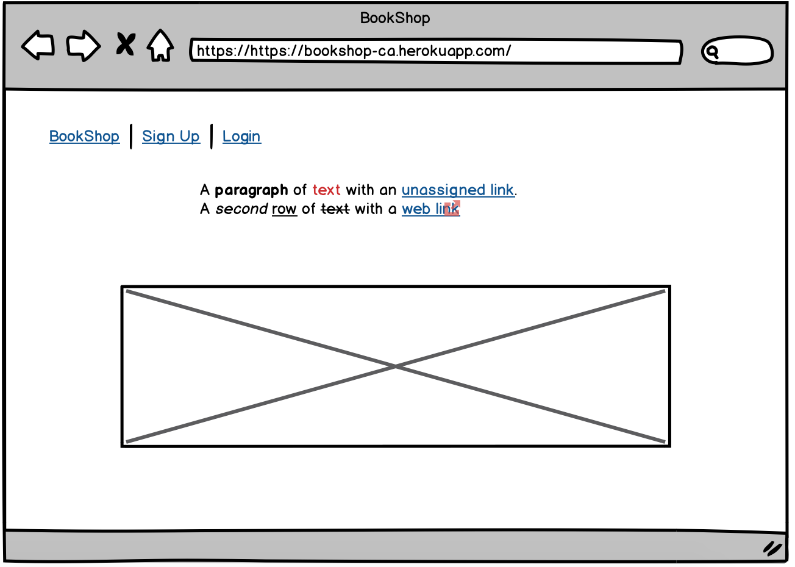

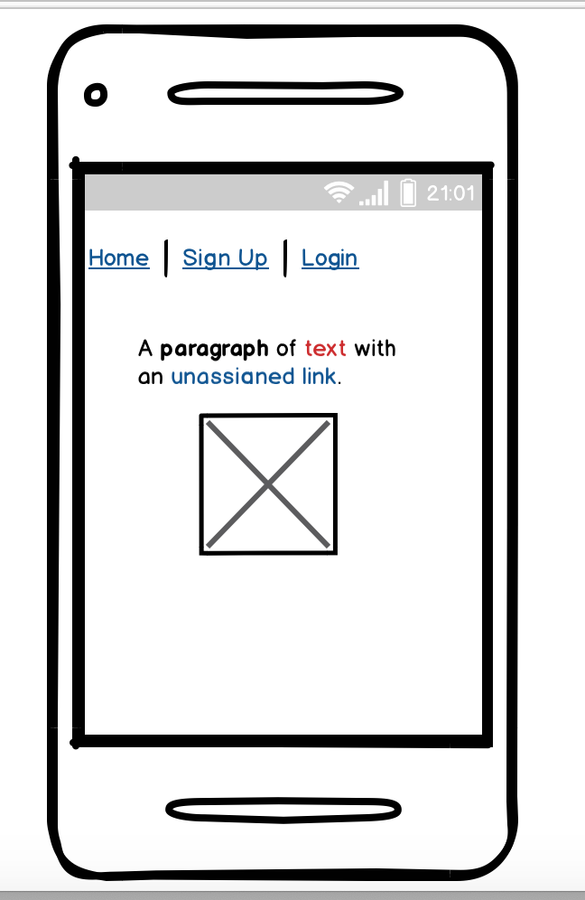

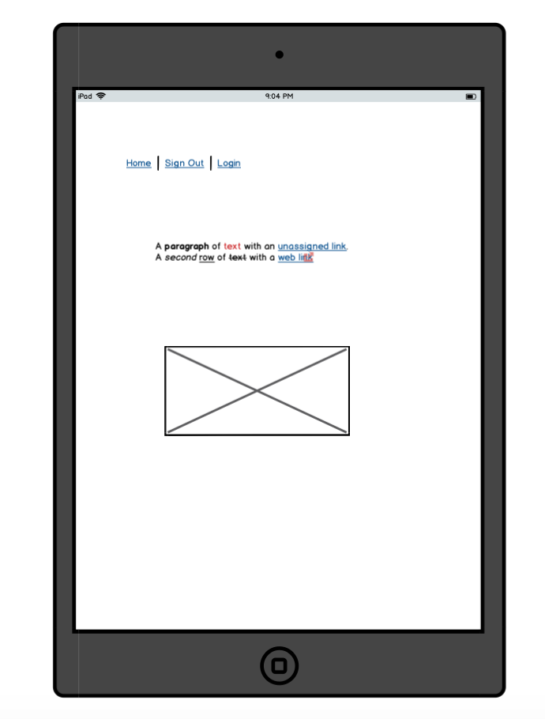

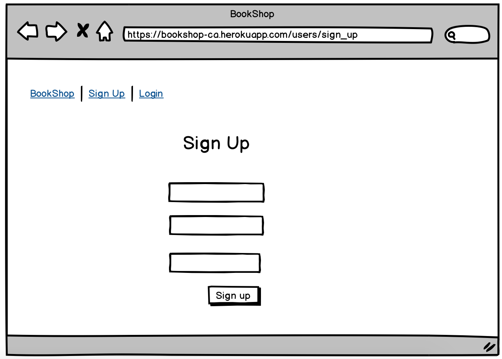

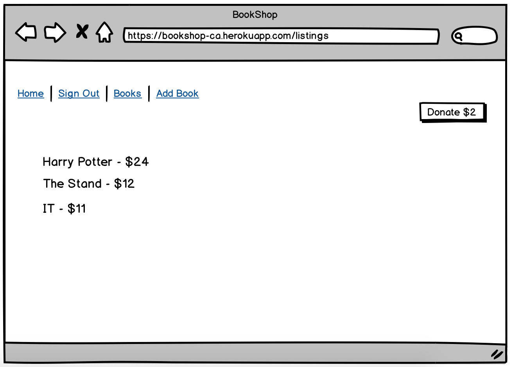


##### 9. Describe the way tasks are planned and tracked in your project.

I followed Bruce's Requirement Checklist
When I completed a task I check the appropiate checkbox

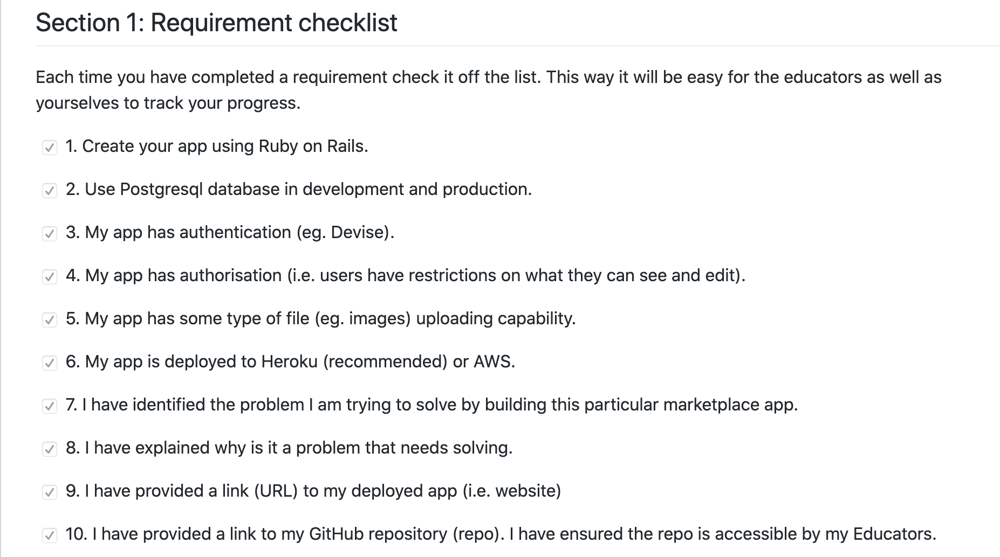
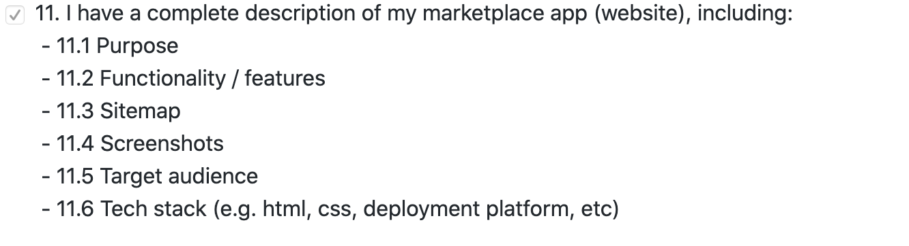
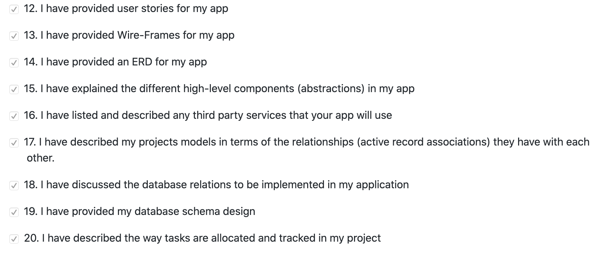
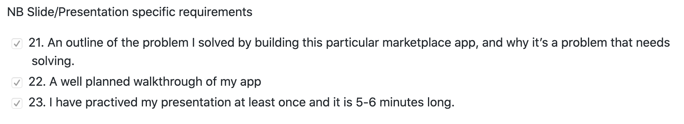


##### 10. ERD provided represents a normalised database model.


